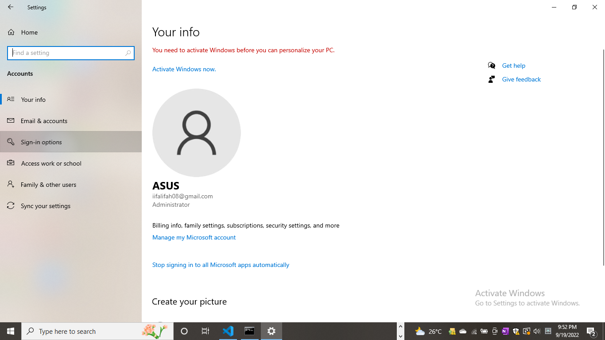

<h2 align="center"><b>Tugas 3 Sistem Operasi</b></h2>

### **1. Komponen Sistem Operasi**

Secara umum, para pakar sepakat bahwa terdapat sekurangnya empat komponen manajeman utama yaitu: 

* Manajemen Proses, 
* Manajemen Memori, dan 
* Manajamen Sistem Berkas. 
* Manajemen Masukan/Keluaran.

Selain keempat komponen di atas, Avi Silberschatz, dan kawan-kawan menambahkan beberapa komponen seperti:

* Manajemen Penyimpanan Sekunder. 
* Manajemen Sistem Proteksi. 
* Manajemen Jaringan. 
* Command-Interpreter System. 

Disini saya akan memberikan 3 contoh dari beberapa komponen sistem operasi antara lain sebagai berikut:

1. Manajemen berkas

Cara untuk membuat folder pada laptop.
 
Hal yang pertama kali harus kita lakukan adalah menuju file explorer. Selain dengan cara dibawah, kita juga dapat mengklik langsung pada shortcut file explorer yang terletak di bar bawah atau mengklik shortcut This PC pada laptop untuk membuka file explorer.

Sete;ah itu akan muncul tampilan seperti gambar di bawah ini

Setelah membuka file explorer tadi, selanjutnya pilih tempat menyimpan folder yang akan dibuat nanti. Misal kita pilih tempat penyimpannya di Data(E:)

Setelah itu klik <b>New Folder</b> pada bagian atas atau bisa juga dengan klik tombol kanan kemudian pilih new, lalu klik folder.

 

Setelah di klik tadi, akan muncul folder baru seperti pada gambar dibawah. Kita bisa mengganti nama pada folder baru tersebut atau tetap menggunakan nama new folder. Sampai pada tahap ini folder baru berhasil dibuat. 

2. Manajemen Masukan/Keluaran.

Sistem ini sering disebut dengan device manager. Menyediakan device driver yang umum sehingga operasi Masukan/Keluaran dapat seragam (membuka, membaca, menulis, menutup). 
Contohnya penggunaan flashdisk.

Masukkan flashdisk pada port USB di laptop. Setelah itu akan muncul pesan seperti gambar dibawah

Jika ingin melepaskan flasdisk dari port USB jangan lupa eject terlebih dahulu agar data yang masih terhubung pada laptop aman.

3. Manajemen Proses                     

Cara untuk melihat dan mengukur setiap proses yang berjalan di laptop pada Task Manager.

Untuk membuka task manager, klik windows+shift+ESC nanti akan muncul tampilan seperti gambar dibawah ini. Pada task manager menampilkan program apa saja yang sedang berjalan. Dalam tampilan ini juga menunjukkan kolom informasi mengenai semua proses yang berjalan, antara lain ada kolom CPU, memory, disk, network dan lain sebagianya

Jika ingin mengakhiri program yang sedang berjalan, hal yang harus dilakukan adalah dengan klik kanan pada touchpad kemudian pilih <i>end task</i>

## **2. Layanan Sistem Operasi**

Layanan sistem operasi dirancang untuk membuat pemrograman menjadi lebih mudah. 

1. Pembuatan Program
2. Eksekusi Program
3. Operasi Masukkan/Keluaran
4. Manipulasi Sistem Berkas
5. Komunikasi
6. Deteksi Error
7. Alokasi Sumber Daya
8. Accounting
9. Proteksi
 

Disini saya akan memberikan 3 contoh dari beberapa layanan sistem operasi antara lain sebagai berikut:

1.  **Pembuatan Program**: Sistem operasi menyediakan berbagai fasilitas yang membantu programer dalam membuat program seperti editor. Contoh nya seperti notepad. 

Notepad atau lengkapnya Microsoft Notepad adalah editor teks untuk membuat file teks sederhana. Fungsi atau kegunaan utama Notepad adalah untuk melihat atau mengedit file teks (text file). Notepad hanya mendukung pemformatan dasar sehingga tidak dapat melakukan pemformatan yang kompleks seperti pada Microsoft Word. Notepad juga tidak mendukung penyisipan gambar. Ketika menjalankan aplikasi ini, Anda hanya akan menemukan fungsi atau perintah-perintah yang sangat dasar untuk memanipulasi teks. File teks yang dibuat dengan Notepad akan menggunakan Format File TXT.   
Meskipun Format File asli Notepad TXT, tapi Aplikasi ini dapat digunakan untuk membuka Dokumen lain dengan Format yang berbeda, misalnya saja file Teks jenis PHP dan html. Dengan hanya Notepad kita dapat membuat program sederhana yang berbasis PHP atau html. Meskipun Notepad dapat digunakan untuk membuat Program dengan bahasa HTML, PHP, C, C++, Java, JavaScript, Perl, Pascal, CSS, dll. Namun fitur-nya masing kurang lengkap atau terbatas.
Kebanyakan para Programmer untuk membuat Coding, lebih memilih menggunakan Notepad jenis lain, yaitu Notepad ++. Dimana Notepad ++ lebih mendukung untuk membuat program. 

Cara mengakses notepad pada windows

Membuka windows search lalu mengetikkan notepad pada kolom pencarian.

Setelah di klik akan muncul tampilan seperti gambar dibawah

Misal kita akan membuat teks HTML. Lalu kita simpan dengan format HTML

kemudian file akan tersimpan dalam folder file kita

2. Eksekusi Program

Sistem harus bisa me-load program ke memori, dan menjalankan program tersebut. Program harus bisa menghentikan pengeksekusiannya baik secara normal maupun tidak (ada error).
 

Misal kita akan menjalankan program Microsoft Word. Maka hal pertama yang kita lakukan dengan mengklik windows+R, sehingga nanti akan muncul tampilan seperti dibawah ini. Setelah itu ketikkan winword lalu klik OK.

Setelah dikli akan tampil

3. Proteksi

Layanan proteksi memastikan bahwa segala akses ke sumber daya terkontrol. Dan tentu saja keamanan terhadap gangguan dari luar sistem tersebut. Keamanan bisa saja dilakukan dengan terlebih dahulu mengidentifikasi pengguna. Ini bisa dilakukan dengan meminta password bila ingin menggunakan sumber daya.  

Beberapa cara untuk membuat password pada sistem operasi windows.
Membuka windows search, lalu ketikkan di kolom pencarian Settings.

Setelah itu klik **Accounts**

Lalu pilih *Sign-in options*

Lalu akan muncul beberapa pilihan ingin menggunakan yang mana, saya memilih password. Kemudian kita di klik nanti kita di minta untuk membuat password.

## **2. System Call**

Biasanya tersedia sebagai instruksi bahasa assembly. Beberapa sistem mengizinkan system calls dibuat langsung dari program bahasa tingkat tinggi. Beberapa bahasa pemrograman (contoh: C, C++) telah didefenisikan untuk menggantikan bahasa assembly untuk sistem pemrograman. Terdapat 5 jenis system call antara lain:

1. System Call Manajemen Proses

System Call untuk manajemen proses diperlukan untuk mengatur proses-proses yang sedang berjalan. Kita dapat melihat penggunaan system calls untuk manajemen proses pada Sistem Operasi Unix. Contoh yang paling baik untuk melihat bagaimana system call bekerja untuk manajemen proses adalah Fork. Fork adalah satu satunya cara untuk membuat sebuah proses baru pada sistem Unix. Fork membuat duplikasi yang mirip dengan proses aslinya, termasuk file descriptor, register, dan lainnya. 

2. System Call Manajemen Berkas

System calls yang berhubungan dengan berkas sangat diperlukan. Seperti ketika kita ingin membuat atau menghapus suatu berkas. Atau ketika ingin membuka atau menutup suatu berkas yang telah ada, membaca berkas tersebut, dan menulis berkas itu. System calls juga diperlukan ketika kita ingin mengetahui atribut dari suatu berkas atau ketika kita juga ingin merubah atribut tersebut. Yang termasuk atribut berkas adalah nama berkas, jenis berkas, dan lain-lain. 

3. System Call manejemn Piranti

Program yang sedang dijalankan kadang kala memerlukan tambahan sumber daya. Jika banyak pengguna yang menggunakan sistem, maka jika memerlukan tambahan sumber daya maka harus meminta peranti terlebih dahulu. Dan setelah selesai penggunakannnya harus dilepaskan kembali. Ketika sebuah peranti telah diminta dan dialokasikan maka peranti tersebut bisa dibaca, ditulis, atau direposisi. 

4. System Call Informasi/Pemeliharaan

Beberapa system calls disediakan untuk membantu pertukaran informasi antara pengguna dan sistem operasi. Contohnya system calls untuk meminta dan mengatur waktu dan tanggal. Atau meminta informasi tentang sistem itu sendiri, seperti jumlah pengguna, jumlah memori dan disk yang masih bisa digunakan, dan lain-lain. Ada juga system calls untuk meminta informasi tentang proses yang disimpan oleh sistem dan system calls untuk merubah (reset) informasi tersebut

5. System Call Komunikasi
Dua model komunikasi:
* **Message-passing**. Pertukaran informasi dilakukan melalui fasilitas komunikasi antar proses yang 
disediakan oleh sistem operasi.
* **Shared-memory**. Proses menggunakan memori yang bisa digunakan oleh berbagai proses untuk 
pertukaran informasi dengan membaca dan menulis data pada memori tersebut. 

Disini saya akan memberikan 3 contoh dari beberapa system call antara lain sebagai berikut: 

* System Call Manajemen Berkas

1. Membuat file baru dengan menggunakan command prompt
 
Membuka windows search, lalu ketikkan di kolom pencarian Command Prompt.

Setelah itu ketikkan terlebih dahulu ingin menyimpan dimana. kali ini saya akan menyimpan folder yang saya buat di Data(E:). Setelah itu ketikkan mkdir dilanjutkan dengan nama folder nya yaitu **file_baru**. Lalu tekan enter.

Setelah itu buka file explorer untuk memeriksa apakah folder yang dibuat tadi sudah berhasil dibuat

2. Mengunci folder dengan menggunakan command prompt 

Membuka windows search, lalu ketikkan di kolom pencarian Command Prompt.

Ketikkan tempat penyimpanan folder yang ajan dikunci. setelah itu tuliskan calcs diikuti nama folder kemudian /p everyone:n.
Lalu akan muncul pernyatan, ketik Y.

Setelah itu kita buka windows explorer, lalu klik folder yang dikunci tadi, nanti akan muncul pesan seperti gambar dibawah

3. Menghapus folder dengan menggunaka command prompt

Membuka windows search, lalu ketikkan di kolom pencarian Command Prompt.

Sebelum folder dihapus

Ketikkan tempat penyimpanan folder yang akan dihapus. setelah itu tuliskan rd diikuti nama folder. kemudian klik enter, folder pun berhasil dihapus

Sesudah di hapus

