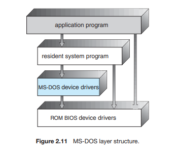
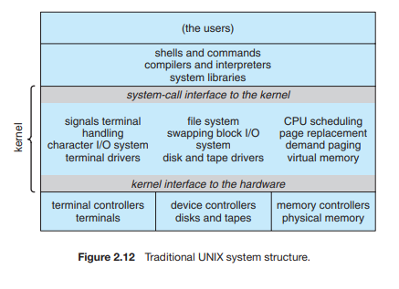
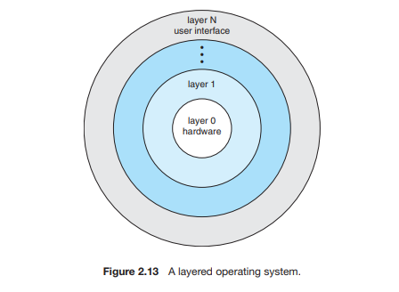
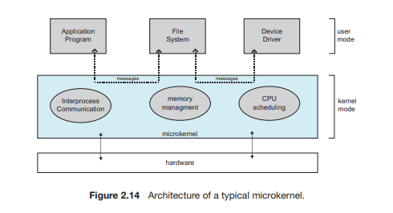

Nama : Iif Alifah

NIM : 2110131220013

Tugas 3 Struktur Sistem Operasi

---

**1. Struktur Monolitik/Sederhana**

Banyak sistem operasi tidak memiliki struktur yang terdefinisi dengan baik. Seringkali, sistem seperti itu dimulai sebagai sistem kecil, sederhana, dan terbatas dan kemudian berkembang lebih jauh dari lingkup asli mereka. Struktur sistem operasi di sistem ini tidak terstruktur. Sistem operasi sebagai kumpulan prosedur yang masing-masing dapat saling dipanggil jika dibutuhkan. Setiap prosedur yang ada di dalam sistem ini mempunyai interface yang sudah didefinisikan dengan baik.<b>MS-DOS</b> adalah contoh dari sistem tersebut. 

 

 
Gambar Struktur MSDOS
 

Di MS-DOS, antarmuka dan tingkat fungsionalitas tidak dipisahkan dengan baik. Misalnya, program aplikasi dapat mengakses rutinitas I/O dasar
untuk menulis langsung ke layar dan disk drive. Kebebasan seperti itu meninggalkan MS-DOS rentan terhadap program yang salah (atau berbahaya), menyebabkan seluruh sistem crash ketika program pengguna gagal. Tentu saja, MS-DOS juga dibatasi oleh perangkat keras dari zamannya. Karena Intel 8088 yang ditulisnya tidak menyediakan dual mode dan tidak ada perlindungan perangkat keras, perancang MS-DOS tidak punya pilihan selain
untuk membiarkan perangkat keras dasar dapat diakses.

Contoh lain dari penataan terbatas adalah sistem operasi <b>UNIX</b> traditional. Seperti MS-DOS, UNIX awalnya dibatasi oleh fungsionalitas perangkat keras. Dia terdiri dari dua bagian yang dapat dipisahkan: kernel dan program sistem.

 

 
Gambar Struktur UNIX
 

Kernel selanjutnya dipisahkan menjadi serangkaian antarmuka dan driver perangkat, yang telah ditambahkan dan diperluas selama bertahun-tahun sebagai UNIX  yang telah berkembang. Kita dapat melihat sistem operasi UNIX tradisional sebagai berlapis sampai batas tertentu, seperti yang ditunjukkan pada Gambar diatas. Semuanya di bawah antarmuka panggilan sistem dan di atas fisik perangkat keras adalah kernel. Kernel menyediakan sistem file, penjadwalan CPU, manajemen memori, dan fungsi sistem operasi lainnya melalui sistem panggilan. Singkatnya, itu adalah sejumlah besar fungsi untuk digabungkan menjadi satu tingkat.

Struktur monolitik ini sulit untuk diterapkan dan dijaga. Namun, itu memiliki keunggulan kinerja yang berbeda: sangat sedikit overhead di antarmuka panggilan sistem atau dalam komunikasi di dalam kernel.
Kami masih melihat bukti struktur monolitik sederhana ini di UNIX, Linux, dan sistem operasi Windows.

---

**2.Struktur Berlapis**

Sistem operasi memiliki lebih banyak kebebasan dalam mengubah cara kerja bagian dalam sistem dan dalam menciptakan sistem operasi modular. Di bawah pendekatan top-down, fungsionalitas dan fitur keseluruhan ditentukan dan dipisahkan menjadi komponen-komponen. Penyembunyian informasi juga penting, karena itu membuat pemrogram bebas untuk mengimplementasikan rutinitas tingkat rendah sesuai keinginan mereka, asalkan antarmuka eksternal rutinitas tetap tidak berubah dan bahwa rutinitas itu sendiri melakukan tugas yang diiklankan.

Suatu sistem dapat dibuat modular dengan banyak cara. Salah satu metode adalah <b>pendekatan berlapis</b>, di mana sistem operasi dipecah menjadi beberapa lapisan (tingkat). Lapisan bawah (lapisan 0) adalah perangkat keras; tertinggi (lapisan N) adalah antarmuka pengguna. Struktur layering ini digambarkan pada Gambar dibawah ini.

 

 
Gambar Struktur Berlapis
 

Lapisan sistem operasi adalah implementasi dari objek abstrak yang dibuat data dan operasi yang dapat memanipulasi data tersebut. Sebuah tipikal
lapisan sistem operasi katakanlah, lapisan M terdiri dari struktur data dan satu set rutinitas yang dapat dipanggil oleh lapisan tingkat yang lebih tinggi. Lapisan M, pada gilirannya, dapat menjalankan operasi pada lapisan tingkat yang lebih rendah

Keuntungan utama dari pendekatan berlapis adalah kesederhanaan konstruksi dan debugging. Lapisan dipilih sehingga masing-masing menggunakan fungsi (operasi) dan layanan hanya lapisan tingkat yang lebih rendah. Pendekatan ini menyederhanakan debugging dan verifikasi sistem. Lapisan pertama dapat di-debug tanpa khawatir untuk sisa sistem, karena menurut definisi hanya menggunakan perangkat keras dasar (yang dianggap benar) untuk mengimplementasikan fungsinya. Setelah lapisan pertama adalah di-debug, fungsinya yang benar dapat diasumsikan sementara lapisan kedua adalah debug, dan sebagainya. Jika kesalahan ditemukan selama debugging tertentu lapisan, kesalahan harus pada lapisan itu, karena lapisan di bawahnya sudah debug. Dengan demikian, desain dan implementasi sistem disederhanakan.

Setiap lapisan diimplementasikan hanya dengan operasi yang disediakan oleh tingkat lapisan yang lebih rendah. Sebuah layer tidak perlu mengetahui bagaimana operasi ini diimplementasikan; ia hanya perlu mengetahui apa yang dilakukan operasi-operasi ini. Oleh karena itu, setiap lapisan menyembunyikan keberadaan struktur data, operasi, dan perangkat keras tertentu dari tingkat yang lebih tinggi lapisan.

Kesulitan utama dengan pendekatan berlapis melibatkan tepat mendefinisikan berbagai lapisan. Karena sebuah layer hanya dapat menggunakan layer dengan level yang lebih rendah, perencanaan yang matang sangat diperlukan. Misalnya, driver perangkat untuk dukungan store (ruang disk yang digunakan oleh algoritme memori virtual) harus lebih rendah tingkat dari rutinitas manajemen memori, karena manajemen memori
membutuhkan kemampuan untuk menggunakan backing store.

Masalah terakhir dengan implementasi berlapis adalah bahwa mereka cenderung kurang efisien dibandingkan jenis lainnya. Misalnya, ketika program pengguna menjalankan I/O operasi, itu mengeksekusi panggilan sistem yang terjebak ke lapisan I/O, yang memanggil lapisan manajemen memori, yang pada gilirannya memanggil lapisan penjadwalan CPU, yang kemudian diteruskan ke perangkat keras. Pada setiap lapisan, parameternya mungkin:
dimodifikasi, data mungkin perlu diteruskan, dan sebagainya. Setiap lapisan menambahkan overhead ke panggilan sistem. Hasil bersihnya adalah panggilan sistem yang membutuhkan waktu lebih lama daripada yang dilakukan pada sistem yang tidak berlapis

Keterbatasan ini telah menyebabkan reaksi kecil terhadap layering beberapa tahun terakhir. Lebih sedikit lapisan dengan lebih banyak fungsionalitas sedang dirancang, menyediakan sebagian besar keuntungan dari kode termodulasi sambil menghindari masalah definisi lapisan dan interaksi.

---

**3.Mikrokernel**

Pada pertengahan 1980-an, para peneliti di Carnegie Mellon Universitas mengembangkan sistem operasi yang disebut Mach yang termodulasi kernel menggunakan pendekatan <b>mikrokernel</b>. Metode ini menyusun sistem operasi dengan menghapus semua komponen yang tidak penting dari kernel dan mengimplementasikannya sebagai sistem dan program tingkat pengguna. Hasilnya adalah kernel yang lebih kecil. Ada sedikit konsensus mengenai layanan mana yang harus tetap di kernel dan mana yang harus diimplementasikan di ruang pengguna. Biasanya, bagaimanapun, mikrokernel menyediakan proses minimal dan manajemen memori, sebagai tambahan
ke fasilitas komunikasi. 

 

 
Gambar Struktur Mikrokernel
 

Fungsi utama dari mikrokernel adalah untuk menyediakan komunikasi antara program klien dan berbagai layanan yang juga berjalan di ruang pengguna. Komunikasi diberikan melalui penyampaian pesan. 

Misalnya, jika program klien ingin mengakses file harus berinteraksi dengan server file. Program dan layanan klien tidak pernah berinteraksi secara langsung. Sebaliknya, mereka berkomunikasi secara tidak langsung dengan bertukar pesan dengan mikrokernel.

Salah satu manfaat dari pendekatan mikrokernel adalah membuat perluasan sistem operasi lebih mudah. Semua layanan baru ditambahkan ke ruang pengguna dan akibatnya tidak memerlukan modifikasi kernel. Ketika kernel melakukannya harus dimodifikasi, perubahannya cenderung lebih sedikit, karena mikrokernelnya adalah kernel yang lebih kecil. Sistem operasi yang dihasilkan lebih mudah untuk port dari satu desain perangkat keras ke yang lain. Mikrokernel juga memberikan lebih banyak keamanan dan keandalan, karena sebagian besar layanan berjalan sebagai pengguna bukan kernel 
proses. Jika layanan gagal, sisa sistem operasi tetap tidak tersentuh.

Beberapa sistem operasi kontemporer telah menggunakan mikrokernel mendekati. Tru64 UNIX (sebelumnya Digital UNIX) menyediakan antarmuka UNIX untuk pengguna, tetapi diimplementasikan dengan kernel Mach. Kernel Mach memetakan UNIX panggilan sistem menjadi pesan ke layanan tingkat pengguna yang sesuai. Mac OS X kernel (juga dikenal sebagai Darwin) juga sebagian didasarkan pada mikrokernel Mach. Contoh lain adalah QNX

Sayangnya, kinerja mikrokernel dapat menurun karena peningkatan overhead fungsi sistem. Pertimbangkan sejarah Windows NT. Pertama
rilis memiliki organisasi mikrokernel berlapis. Performa versi ini rendah dibandingkan dengan Windows 95. Windows NT 4.0 sebagian
memperbaiki masalah kinerja dengan memindahkan lapisan dari ruang pengguna ke ruang kernel dan mengintegrasikannya lebih dekat. Pada saat Windows XP dirancang, arsitektur Windows telah menjadi lebih monolitik daripada mikrokernel.

---

Dari penjelasan diatas dapat diambil kesimpulan bahwa: 

* Struktur sederhana atau monolitik merupakan struktur sistem operasi yang tidak terstruktur. Sistem operasi ini sebagai kumpulan prosedur yang masing-masing dapat saling dipanggil jika dibutuhkan. Setiap prosedur yang ada di dalam sistem ini mempunyai interface yang sudah didefinisikan dengan baik.
* Struktur berlapis merupakan sistem operasi dipecah menjadi beberapa lapisan (tingkat). Lapisan bawah (lapisan 0) merupakan perangkat keras dan yang tertinggi (lapisan N) merupakan antarmuka pengguna. Lapisan sistem operasi adalah implementasi dari objek abstrak yang dibuat data dan operasi yang dapat memanipulasi data tersebut. Keuntungan utama dari pendekatan berlapis adalah kesederhanaan konstruksi dan debugging.
* Mikrokernel merupakan metode menyusun sistem operasi dengan menghapus semua komponen yang tidak penting dari kernel dan mengimplementasikannya sebagai sistem dan program tingkat pengguna. Berfungsi untuk menyediakan komunikasi antara program klien dan berbagai layanan yang juga berjalan di ruang pengguna. Komunikasi diberikan melalui penyampaian pesan. Manfaat dari pendekatan mikrokernel adalah membuat perluasan sistem operasi lebih mudah