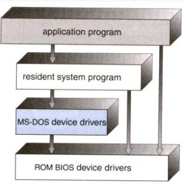
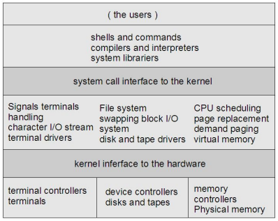
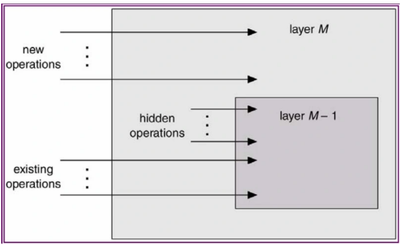

<h2 align="center"><b>Tugas 4 Struktur Sistem Operasi</b></h2>

---

Sistem operasi modern adalah suatu sistem yang besar dan kompleks. Dan tentu saja proses mendesain
sistem operasi bukanlah pekerjaan mudah. Karena itu, didalam desain sistem operasi digunakan suatu struktur agar sistem tersebut bisa dipelajari dengan mudah. digunakan, dan dikembangkan lebih lanjut. Disini akan dibahas 3 struktur sistem operasi yaitu sebagai berikut:

1. Struktur Sederhana
2. Struktur Berlapis
3. Mikro Kernel

---

## **1. Struktur Sederhana**

Pada awalnya, sistem operasi dimulai sebagai sistem yang kecil, sederhana, dan terbatas. Lama kelamaan, sistem operasi semakin berkembang menjadi suatu sistem yang lebih besar dari awalnya.
Dalam perkembangannya, ada sistem yang terstruktur dengan kurang baik, dan ada juga yang baik.

Contoh sistem operasi yang memiliki struktur sederhana adalah MS DOS dan UNIX.

* **MS DOS**

MSDOS menggunakan sistem operasi single tasking. Yaitu CPU menyelesaikan satu proses sampai selesai dan tidak dapat disisipi proses lain. Selain itu MSDos juga bersifat single mode yaitu tanpa proteksi perangkat keras. Dalam MSDos, perintah internal telah dimasukkan ke dalam <i>command.com</i> (interpreter perintah DOS), sehingga dapat langsung dieksekusi oleh kernel DOS dimana saja. Sedangkan perintah eksternal tidak dimasukkan ke dalam <i>command.com</i>, dan membutuhkan sebuah berkas yangdapat dieksekusi (berupa program DOS) yang harus terdapat dalam direktori aktif.

* **UNIX**

UNIX adalah sistem operasi yang terdiri dari 2 bagian penting yaitu Kernel dan program sistem. Kernel UNIX berisi sistem file, penjadwalan CPU, manajemen memori dan system call. Sedangkan program sistem bertugas memanggil fungsi yang ada pada kernel. 
Sejak awal UNIX dirancang untuk mendukung multitasking yakni dapat mengerjakan lebih dari satu tugas pada waktu yang bersamaan. Misalnya membuka beberapa shell dan mengerjakan tugas-tugas berbeda pada shell-shell tersebut. Selain itu UNIX memperlakukan device dan file dalam derajat yang sama sehingga tidak ada batasan pada jumlah device yang dipasang

Keunggulan dari struktur sederhana sistem operasi ini yaitu:
 
* layanan dapat dilakukan dengan cepat karena terdapat dalam satu ruang.

Kelemahan dari struktur sederhana sistem operasi ini yaitu:
 
* Pengujian dan penghilangan kesalahan sulit karena tidak dapat dipisahkan dan dialokasikan.
 
* Sulit dalam menyediakan fasilitas pengamanan.
 
* Pemborosan memori bila setiap komputer harus menjalan kernel, karena semua layanan tersimpan dalam bentuk tunggal sedangkan tidak semua layanan diperlukan.
 
* Kesalahan sebagian fungsi menyebabkan sistem tidak berfungsi.

---

## **2. Struktur Berlapis**

Sistem operasi dibentuk secara hirarki berdasar lapisan-lapisan, dimana lapisan-lapisan bawa memberi layanan lapisan lebih atas. Lapisan yang paling bawah adalah perangkat keras, dan yang paling tinggi adalah userinterface. Sebuah lapisan adalah implementasi dari obyek abstrak yang merupakan enkapsulasi dari data dan operasi yang bisa memanipulasi data tersebut. Struktur berlapis dimaksudkan untuk mengurangi kompleksitas rancangan dan implementasi sistem operasi. Tiap lapisan mempunyai fungsional dan antarmuka masukan-keluaran antara dua lapisan bersebelahan yang terdefinisi bagus.

Menurut Tanenbaum dan Woodhull, sistem terlapis terdiri dari
enam lapisan, yaitu:

* Lapis 5 – **The operator**. Berfungsi untuk pemakai operator.
* Lapis 4 – **User programs**. Berfungsi untuk aplikasi program pemakai.
* Lapis 3 – **I/O management**. Berfungsi untuk menyederhanakan akses I/O pada level atas.
* Lapis 2 - **Operator-operator communication**. Berfungsi untuk mengatur komunikasi antar proses.
* Lapis 1 - **Memory and drum management**. Berfungsi untuk mengatur alokasi ruang memori atau drum magnetic.
* Lapis 0 - **Processor allocation and multiprogramming**. Berfungsi untuk mengatur alokasi pemroses dan switching, multi programming dan pengaturan prosessor.

Stallings memberi model yang lebih detail, sebagai berikut:
* Lapisan 1. Berisi berbagai sirkuit elektronik, misal register, memory cells, dan logic gate.
* Lapisan 2. Berisi instruksi prosesor, misal instruksi aritmatika, instruksi transfer data, dsb.
* Lapisan 3. Penambahan konsep seperti prosedur/subrutin, maupun fungsi yang me-return nilai
tertentu.
* Lapisan 4. Penambahan interrupt.
* Lapisan 5. Program sebagai sekumpulan instruksi yang dijalankan oleh prosesor.
* Lapisan 6. Berhubungan dengan secondary storage device, yaitu membaca/menulis head, track,
dan sektor.
* Lapisan 7. Menciptakan alamat logika untuk proses. Mengatur hubungan antara main memory,
virtual memory, dan secondary memory.
* Lapisan 8. Program sebagai sekumpulan instruksi yang dijalankan oleh prosesor.
* Lapisan 9. Berhubungan dengan secondary storage device, yaitu membaca/menulis head,track,
dan sektor.
* Lapisan 10. Menciptakan alamat logika untuk proses. Mengatur hubungan antara main memory,
virtual memory, dan secondary memory.
* Lapisan 11. Program sebagai sekumpulan instruksi yang dijalankan oleh prosesor.
* Lapisan 12. File adalah objek yang memiliki nama dan ukuran. Abstraksi dari lapisan 9.
* Lapisan 13. Menyediakan interface agar bisa berinteraksi dengan pengguna.

Lapisan-lapisan dari 1-4 bukanlah bagian dari sistem operasi dan masih menjadi bagian dari prosesor secara ekslusif.
Lapisan ke-5 hingga ke-7, sistem operasi sudah berhubungan dengan prosesor. Selanjutnya dari lapisan ke-8 hingga 13, sistem operasi berhubungan dengan media penyimpanan maupun perlatan-peralatan lain yang ditancapkan, misalnya peralatan jaringan.

Beberapa jenis lapisan yang digunakan dalam sistem operasi berlapis adalah :

* Lapisan Perangkat Keras

Lapisan perangkat keras merupakan lapisan paling bawah pada sistem operasi berlapis. Lapisan ini terdiri dari sirkuit elektronik yang berfungsi untuk membersihkan register ataupun membaca lokasi memori, set instruksi pada prosesor, serta interupsi yang berisikan perintah yang dijalankan.

* Lapisan Sistem Operasi

Lapisan sistem operasi merupakan sebuah lapisan yang berhubungan secara langsung dengan program spesifik pada bagian sistem operasinya.

Lapisan ini memiliki kerja yang bersifat teknis dan terdiri dari penyimpanan sekunder komputer, ide dalam eksekusi program, dan lamat logic dari setiap proses yang berlangsung. Kode program sangat diperlukan pada lapisan ini agar dapat terlaksanakan dengan benar dan sesuai dengan yang diharapkan.

* Lapisan Kelengkapan

Lapisan kelengkapan masih berhubungan dengan program karena termasuk dari kelengkapan sebuah sistem operasi. Lapisan ini memiliki tugas utama sebagai pengaturan komunikasi informasi yang berlangsung, termasuk menerima pesan-pesan dan proses pengirimannya.

Lapisan ini juga memiliki tugas dalam penyimpanan jangka panjang, menyediakan akses pada perangkat keras eksternal yang menggunakan user interface standar, dan bertanggung jawab dalam hubungan identifier internal atau eksternal.

* Lapisan Program Aplikasi

Lapisan program aplikasi bertujuan untuk menghubungkan pengguna dengan aplikasi yang digunakan, dimana sangat berhubungan erat dengan user interface. Lapisan ini akan memproses segala informasi yang dibutuhkan oleh pengguna dalam aplikasi.

Contoh sistem yang memiliki struktur berlapis adalah THE (TechnischeHogeschool at Eindhoven).

THE adalah sistem yang memiliki struktur 6 lapisan seperti :
* Lapis 5 - **The operator** untuk pemakai/operator.
* Lapis 4 - **User programs** untuk aplikasi program pemakai.
* Lapis 3 - **I/O management** menyederhanakan akses I/O pada level atas.
* Lapis 2 - **Operator-operator communication** untuk mengatur komunikasi antar proses.
* Lapis 1 - **Memory and drum management** untuk mengatur alokasi ruang memori atau drum magnetic.
* Lapis 0 - **Processor allocation and multiprogramming** untuk mengatur alokasi pemroses dan switching, multi programming dan pengaturan prosessor

Struktur THE dirancang agar sistem dapat membagi tugas pokok menjadi beberapa modul dan tiap modul dirancang secara independen. Tiap lapisan dapat dirancang, dikode dan diuji secara independen. struktur berlapis juga dapat menyederhanakan rancangan, spesifikasi dan implementasi sistem operasi.

Kelebihan Sistem Berlapis (layered system):
* Memiliki rancangan modular, yaitu sistem dibagi menjadi beberapa modul & tiap modul dirancang secara independen.
* Pendekatan berlapis menyederhanakan rancangan, spesifikasi dan implementasi sistem operasi.

Kekurangan Sistem Berlapis (layered system):
* Fungsi-fungsi sistem operasi diberikan ke tiap lapisan secara hati-hati.
Contoh: Sistem operasi yang menggunakan pendekatan berlapis adalah THE yang dibuat oleh Djikstra dan mahasiswa-mahasiswanya, serta sistem operasi MULTICS.
---

## **3. Mikro Kernel**

Kernel adalah komponen sentral dari sistem operasi. Ia mengatur hal-hal seperti interrupt handler(untuk menyediakan layanan interupsi), process scheduler(membagi-bagi proses dalam
prosesor), memory management, I/O, dan sebagainya. Atau dengan kata lain, ia adalah jembatan antara hardware dengan software.

Cara tradisional untuk membangun sistem operasi adalah dengan membuat kernel monolitis, yaitu semua fungsi disediakan oleh kernel, dan ini menjadikan kernel suatu program yang besar dan
kompleks. Cara yang lebih modern, adalah dengan menggunakan kernel mikro. Pada awalnya, konsep mikro kernel dikembangkan pada sistem operasi Mach. Ide dasar dari pengembangan kernel mikro adalah bahwa hanya fitur-fitur yang perlu saja yang diimplementasikan dalam kernel (mengenai fitur-fitur apa saja yang perlu diimplementasikan, ini bisa berbeda tergantung desain sistem operasi).

Walaupun garis pembatas mengenai apa saja yang berada di dalam dan luar kernel mikro bisa berbeda antara desain yang satu dengan yang lain, namun ada karakteristik yang umum, yaitu servis-servis yang umumnya menjadi bagian sistem operasi menjadi subsistem eksternal yang bisa berinteraksi satu sama
lain dan dengan kernel tentunya. Ini mencakup device driver, file system, virtual memory manager, windowing system, dan security devices. Pendekatan kernel mikro menggantikan pendekatan berlapis yang vertikal tradisional.

Komponen-komponen sistem operasi yang berada di luar kernel mikro diimplementasikan sebagai server process dan berkomunikasi dengan message passing via kernel mikro. Misalnya jika user ingin
membuat berkas baru, dia mengirim pesan ke file system server, atau jika ingin membuat proses baru, dia mengirimkan pesan ke process server.

  <b>Struktur Kernel</b>

Contoh sistem operasi yang menggunakan kernel
mikro adalah MacOS X.

Mac OS adalah sistem operasi yang menggunakan kernel BSD sehingga beberapa kalangan mengatakan bahwa Mac OS X termasuk dalam keluarga Unix. Kernel Mac OS mengusung metode struktur ini untuk menghilangkan komponen-komponen yang tidak diperlukan dari kernel dan mengimplementasikannya sebagai sistem dan program-program level user. Hal ini akan menghasilkan kernel yang kecil. Fungsi utama dari jenis ini adalah menyediakan fasilitas komunikasi antara program client dan bermacam pelayanan yang berjalan pada ruang user.

Beberapa kelebihan kernel mikro:
* Interface yang seragam. Proses tidak lagi dibedakan, baik antara kernel-level maupun userlevel, karena semuanya berkomunikasi via message passing.

* Extensibility . Bisa menambahkan fitur-fitur baru tanpa perlu melakukan kompilasi ulang.

* Flexibility . Fitur-fitur yang sudah ada bisa dikurangi, atau dimodifikasi sesuai dengan kebutuhan sehingga menjadi lebih efisien. Misalnya tidak semua pengguna membutuhkan security
yang sangat ketat, atau kemampuan untuk melakukan distributed computing.

* Portability . Pada kernel mikro, semua atau sebagian besar kode yang prosesor-spesifik berada di dalamnya. Jadi, proses porting ke prosesor lain bisa dilakukan dengan relatif sedikit usaha. Pada kelompok desktop misalnya, tampaknya dominasi Intel makin kuat. Tapi, sampai seberapa lama itu bisa bertahan? Karena itulah, portability adalah salah satu isu yang sangat penting.

* Reliability . Semakin besar suatu software, maka tentulah semakin sulit untuk menjamin reliability-nya. Desain dengan pendekatan berlapis sangatlah membantu, dan dengan pendekatan
kernel mikro bisa lebih lagi. Kernel mikro dapat dites secara ekstensif .Karena dia menggunakan API yang sedikit, maka bisa meningkatkan kualitas code di luar kernel.

* Support for object-oriendted OS . Model kernel mikro sangat sesuai untuk mengembangkan sistem operasi yang berbasis object-oriented. 

Kekurangan dari mikro kernel yaitu:
* Kinerja akan berkurang selagi bertambahnya fungsi-fungsi

